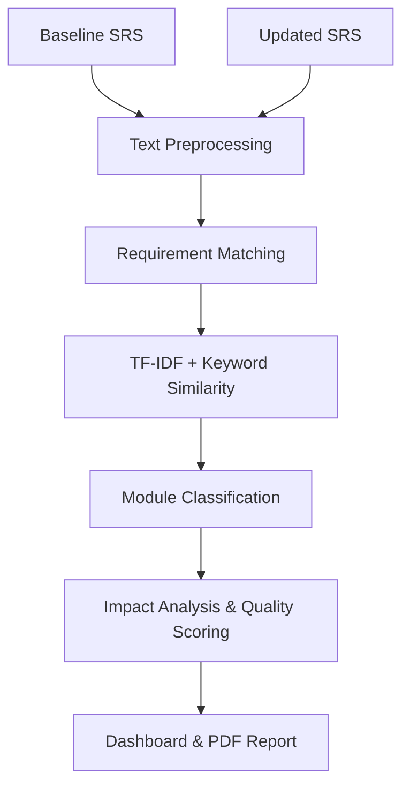

<div align="center">

# 🚀 ReqVision AI

**Intelligent Requirement Drift & Scope Impact Analysis Platform**

[](https://reactjs.org/)
[](https://vitejs.dev/)
[](https://tailwindcss.com/)
[](https://python.org/)
[](https://flask.palletsprojects.com/)
[](https://scikit-learn.org/)


**[🔴 Live Demo (Vercel)](https://req-vision-ai.vercel.app) &nbsp;&nbsp;|&nbsp;&nbsp; [⚙️ Backend API (Render)](https://reqvision-backend.onrender.com)**

*Transform manual, tedious SRS document reviews into instant, deterministic AI analytics.*

</div>

---

## 🎯 Problem Statement & Motivation

In agile and enterprise software development, requirements constantly evolve. When an updated Software Requirement Specification (SRS) document is published, engineering teams struggle to quickly identify **exactly what changed**, **which modules are affected**, and **how much testing is required**. 

Manual reviews lead to missed requirements, undocumented scope creep, and increased regression bugs. **ReqVision AI** solves this by automating the requirement traceability process using natural language processing (NLP), giving teams immediate visibility into project volatility and architectural risk.

---

## ✨ Core Capabilities (What It Actually Does)

ReqVision AI doesn't rely on black-box, hallucination-prone LLMs. It uses **deterministic NLP algorithms** to provide mathematical certainty:

- 📊 **Semantic Document Comparison**: Detects Unchanged, Modified, Added, and Removed requirements using a dual-layer NLP algorithm (TF-IDF + Token Overlap).
- 🧠 **Smart Risk Analysis**: Automatically generates professional executive summaries highlighting architectural risks, business impacts, and precise testing recommendations.
- 🏷️ **Functional Module Intelligence**: Categorizes requirements into 15+ business modules (Authentication, Database, API, Performance, Security, etc.) to pinpoint exact areas of scope expansion.
- 💯 **Requirement Quality Scoring**: Scores requirements (0-100) based on grammar rules, atomicity (detecting complex AND/OR joins), and ambiguity levels.
- 🔍 **Interactive Traceability Matrix**: A fully searchable, sortable data table that maps requirement status, risk, and change reasons, featuring smooth click-to-scroll timeline navigation.
- 🎨 **Premium SaaS UI**: Built with React, Tailwind CSS v4, Framer Motion, and Recharts for a highly polished, Jira/Linear-style user experience.
- 📄 **Export to PDF**: Generate shareable, multi-page executive reports with repeating headers for stakeholders in one click.

---

## 🏗️ Architecture & Workflow

ReqVision AI uses a decoupled architecture separating a React frontend from a Python Flask backend NLP pipeline.



---

## 🔬 Under the Hood: The NLP Engine

### 1. The Similarity Algorithm (Match Score)
We calculate an **Overall Match** score using a weighted combination of two metrics:
- **Semantic Match (70%)**: Uses `TfidfVectorizer(ngram_range=(1,2))` to generate sparse vectors, followed by Cosine Similarity to measure the semantic distance between the baseline and updated requirement.
- **Keyword Match (30%)**: Calculates a Jaccard-like intersection of unique, normalized tokens to ensure critical nouns and verbs overlap.

### 2. Module Classification
Requirements are passed through an intelligent keyword-based classification engine. By detecting domain-specific terminology, requirements are routed into categories like **Security**, **Payments**, **Performance**, **Database**, or **Inventory**, allowing the system to accurately calculate risk levels (e.g., changes to Payments trigger a "High Risk" flag).

### 3. Quality Score Formula
Every requirement starts with a base score of 100. Deductions are applied programmatically:
- **Ambiguity**: -5 points for every vague word detected (e.g., *fast, robust, user-friendly, approximately*).
- **Atomicity**: -15 points if the requirement contains multiple conjunctions (AND/OR), indicating it should be split.
- **Passive Voice / Length**: Deductions for overly verbose or passive phrasing.

---

## 💻 Tech Stack

| Frontend | Backend | Data Processing | Deployment |
|----------|---------|-----------------|------------|
| React 19 | Python 3.10 | scikit-learn | Vercel (UI) |
| Vite | Flask | NLTK | Render (API) |
| Tailwind CSS v4 | Gunicorn | NumPy | |
| Framer Motion | | | |
| Recharts | | | |

---

## 📁 Folder Structure

```text
req-vision-ai/
├── backend/
│   ├── api/routes/compare.py     # REST API endpoints
│   ├── analytics/                # Module detection & Risk summaries
│   ├── utils/                    # NLP matching & Similarity algorithms
│   ├── app.py                    # Flask server entry
│   └── render.yaml               # Deployment configuration
├── frontend/
│   ├── src/
│   │   ├── components/           # React UI Components (DiffCards, Matrix, Charts)
│   │   ├── pages/Dashboard.jsx   # Main analytics view
│   │   └── index.css             # Tailwind config & animations
│   └── vercel.json               # Deployment configuration
└── sample_*.txt                  # Example SRS datasets for testing
```

---

## ⚙️ Installation & Setup

### Backend (Python API)
```bash
cd backend
python3 -m venv venv
source venv/bin/activate
pip install -r requirements.txt
python app.py
```
*(Note: NLTK models will download automatically on the first run. The API runs on `http://localhost:5000`)*

### Frontend (React UI)
```bash
cd frontend
npm install
npm run dev
```
*(The Dashboard runs on `http://localhost:5173`)*

---

## 🚀 Future Scope

- **Git Integration**: Pull SRS documents directly from GitHub/GitLab repositories.
- **Jira Syncing**: Automatically convert "Modified" requirements into Jira tickets for QA review.
- **Historical Trends**: Persist project data to a database to track requirement volatility over multiple sprints.

---

## 🏆 Resume Highlights
This project demonstrates proficiency in **Full-Stack Software Engineering**, **Natural Language Processing (NLP)**, **Information Retrieval algorithms**, **REST API Design**, and **Advanced UI/UX Data Visualization**.
